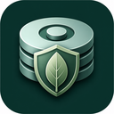
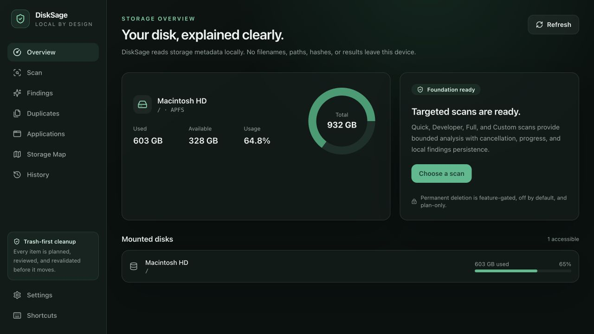
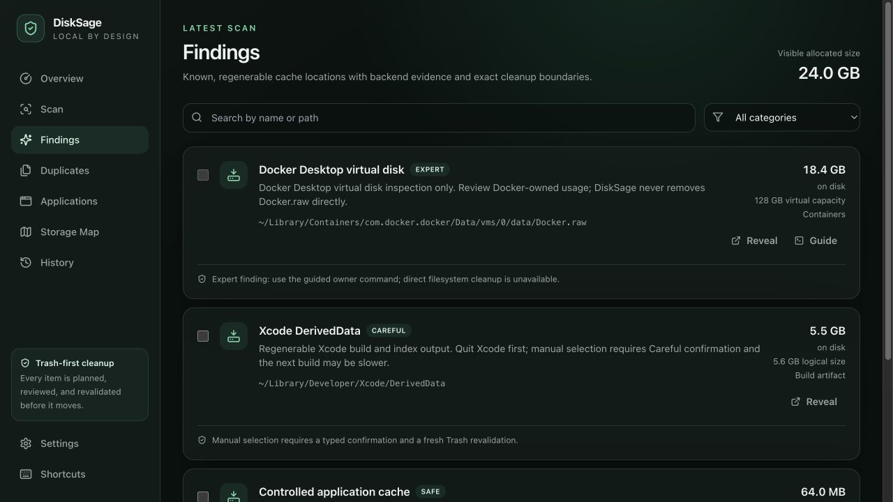
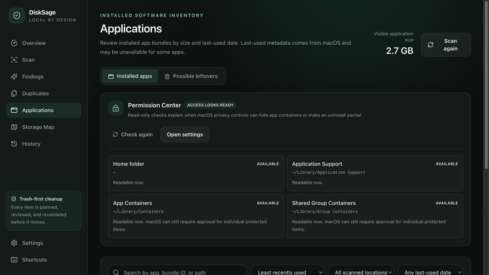
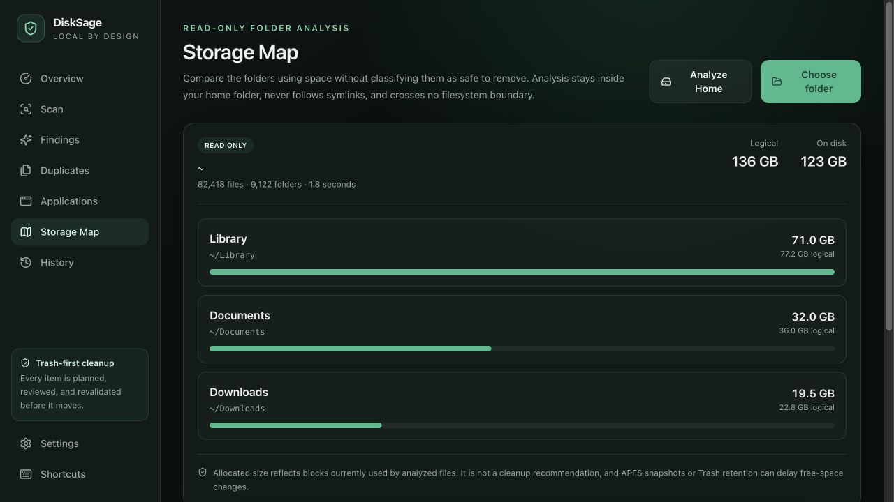
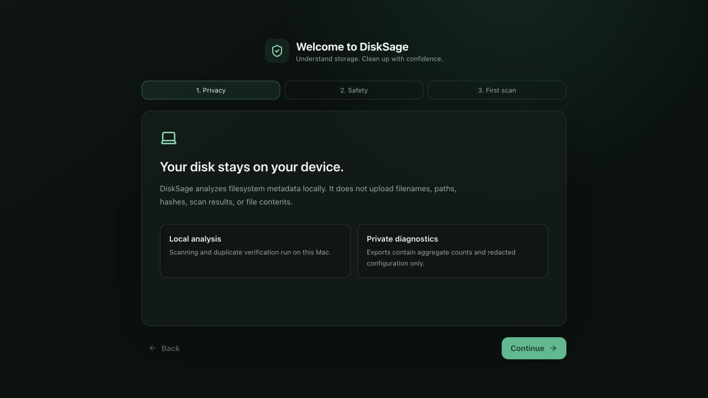

<p align="center">
  
</p>

<h1 align="center">DiskSage</h1>

<p align="center">
  <strong>The intelligent disk cleaner for developers and power users.</strong><br>
  See where your storage really goes. Understand every recommendation. Clean only what you trust.
</p>

<p align="center">
  <a href="https://github.com/talaatmagdyx/disk_sage/actions/workflows/ci.yml"></a>
  
  
  
  
  <a href="LICENSE"></a>
</p>

<p align="center">
  <a href="https://talaatmagdyx.github.io/DiskSage/">Website</a> ·
  <a href="#install">Install</a> ·
  <a href="#product-tour">Product tour</a> ·
  <a href="#the-safety-model">Safety model</a> ·
  <a href="docs/architecture.md">Architecture</a> ·
  <a href="docs/safety-policy.md">Safety policy</a>
</p>



## Why DiskSage exists

Modern development machines accumulate package caches, build artifacts, container layers, virtual disks, IDE indexes, simulator data, browser tooling, and local AI models. Traditional storage views often show only a large folder; one-click cleaners may call it all junk.

DiskSage takes a different approach. It explains **what an item is, why it exists, how it was identified, and what could happen if it is removed**. It optimizes for an informed decision—not the largest possible cleanup number.

## What it gives you

| | | |
| --- | --- | --- |
| **🛡️ Safe cleanup**<br>Safe, Careful, and Expert tiers separate regenerable data from disruptive or owner-managed assets. | **📦 Developer intelligence**<br>Purpose-built rules understand development tools instead of treating every large directory alike. | **🔍 Explain every finding**<br>See evidence, boundaries, allocated size, and the recommended next action before cleanup. |
| **🗑️ Trash-first plans**<br>Review an immutable plan, then revalidate every path immediately before it moves. | **🧠 Verified duplicates**<br>Staged BLAKE3 hashing and optional byte comparison prevent same-size guesses. | **📊 Storage Map**<br>Compare logical and allocated folder sizes without turning analysis into a deletion recommendation. |
| **📱 Application intelligence**<br>Find rarely used apps and preview app-only or attributed-data uninstall plans. | **🔐 Permission Center**<br>Understand partial macOS access, Full Disk Access guidance, and safe retries. | **🏠 Local by design**<br>No cloud account, telemetry, background cleanup daemon, or uploaded scan data. |

### Developer data DiskSage understands

`npm` · `pnpm` · `Yarn` · Cargo · `uv` · pip · Homebrew · Gradle · Maven · CocoaPods · SwiftPM · Xcode · Android Studio · JetBrains IDEs · VS Code · Cursor · Zed · Playwright · Cypress · Docker · Colima · Lima · OrbStack · Hugging Face · PyTorch · Ollama

Virtual disks, models, active runtimes, archives, and ambiguous application data remain review-only or guided actions. Recognition never means automatic deletion.

### Designed for

- Developers whose machines collect build systems, package managers, containers, simulators, and local models.
- Power users who want more evidence than a generic “junk” label.
- Anyone who prefers recoverable, explicit cleanup over silent automation.

## The safety model

“Large” is not a safety classification. Every DiskSage rule declares an exact boundary and one memorable tier:

| Tier | What it means | DiskSage behavior |
| --- | --- | --- |
| **Safe** | Narrow, regenerable caches and downloaded artifacts | Eligible for a reviewed Trash plan; revalidated before execution. |
| **Careful** | Data whose removal may cause downloads, reindexing, reset state, or lost convenience | Explicit selection plus typed confirmation; Trash only. |
| **Expert** | Docker/VM disks, models, active bundles, and owner-managed stores | Inspection or guided owner command; never selected automatically. |

For example, DiskSage can explain the allocated and virtual capacity of `Docker.raw`, but it never removes that disk directly. It guides you to Docker's own maintenance tools.

## Product tour

<table>
  <tr>
    <td width="50%"><br><strong>Findings</strong><br>Evidence and Safe, Careful, or Expert classification.</td>
    <td width="50%"><br><strong>Applications & Permission Center</strong><br>Last-used inventory, uninstall scope, and access guidance.</td>
  </tr>
  <tr>
    <td width="50%"><br><strong>Storage Map</strong><br>Read-only logical and allocated size comparison.</td>
    <td width="50%"><br><strong>Privacy onboarding</strong><br>Local analysis and redacted diagnostics from first launch.</td>
  </tr>
</table>

Release images use [deterministic, path-free fixtures](docs/screenshots/README.md); no contributor's disk paths enter the repository.

## A cleanup is a transaction, not a button

```text
Scan → Review evidence → Build a plan → Revalidate → Move to Trash → Record the result
```

The Rust backend verifies the persisted finding, approved root, file type, size, modification time, symlink state, and protected-path policy immediately before cleanup. Changed or inaccessible items fail closed and remain on disk.

## Why not just use…?

| Tool | Excellent for | What DiskSage adds |
| --- | --- | --- |
| **Finder / system storage** | Browsing files and broad storage categories | Developer-aware rules, safety tiers, evidence, and cleanup plans. |
| **`du` / `ncdu`** | Fast, transparent size exploration | Meaning, risk classification, duplicate verification, Trash plans, and history. |
| **A general-purpose cleaner** | Broad convenience and familiar categories | Explain-first decisions, developer-specific data, exact boundaries, and fail-closed revalidation. |
| **Shell cleanup scripts** | Maximum flexibility and automation | A visible plan, protected paths, partial-failure reporting, cancellation, and a local audit trail. |

DiskSage complements filesystem explorers. Storage Map tells you **where** space is used; findings explain **what it is and whether cleanup is appropriate**.

## Design principles

- **Never delete silently.** Every action starts with a visible plan.
- **Explain before recommending.** Evidence and consequences belong in the UI.
- **Fail closed.** Changed, redirected, protected, or inaccessible paths stay untouched.
- **Trash before permanent deletion.** Recoverability is the default.
- **Keep authority in Rust.** The UI cannot authorize arbitrary filesystem changes.
- **Stay local.** Paths, hashes, contents, and results do not leave the device.
- **Treat ambiguity as risk.** Unclear ownership moves a finding toward review-only, not automatic selection.
- **Use platform-native ownership.** Docker, emulators, and similar systems clean their own state.

## Install

DiskSage is currently a **pre-release project**. Release workflows target:

- macOS 10.15 or later: Apple silicon and Intel DMGs
- Ubuntu 22.04 or a compatible modern Linux distribution: AppImage and Debian package

Public macOS artifacts are expected to be Developer ID signed, notarized, and stapled. Development builds are unsigned. See [INSTALL.md](INSTALL.md) for install, upgrade, uninstall, and source-build details.

### Run from source

Prerequisites: Node.js `20.19+` or `22.12+`, npm, Rust `1.88`, and the [Tauri 2 platform prerequisites](https://v2.tauri.app/start/prerequisites/).

```bash
git clone https://github.com/talaatmagdyx/disk_sage.git
cd disk_sage
npm ci
npm run tauri dev
```

## Performance without invented numbers

DiskSage uses bounded concurrency, cancellation tokens, throttled progress events, same-filesystem traversal, and list virtualization. The repository includes an ignored release-candidate fixture that creates and scans 100,000 files:

```bash
cargo test --manifest-path src-tauri/Cargo.toml \
  scanner::walker::tests::scans_one_hundred_thousand_files -- --ignored --nocapture
```

Repeatable multi-machine timing, peak-memory, hashing, startup, and package-size baselines will be published before performance claims are added here. Hardware-specific marketing numbers would conflict with DiskSage's evidence-first philosophy.

## FAQ

<details><summary><strong>Does DiskSage upload filenames, paths, hashes, or file contents?</strong></summary><br>No. Scanning, rule evaluation, duplicate hashing, and cleanup run locally. Diagnostic exports contain aggregate counts and redacted configuration.</details>

<details><summary><strong>Does it delete anything automatically?</strong></summary><br>No. Safe findings may be selected for review; Careful findings require explicit confirmation; Expert findings are review-only or guided actions. Cleanup still requires a visible plan.</details>

<details><summary><strong>Can DiskSage restore cleaned items?</strong></summary><br>DiskSage moves eligible items to the operating-system Trash by default. Restore them using Finder or your desktop environment's Trash interface. DiskSage does not implement a separate restore layer.</details>

<details><summary><strong>Why did free space increase by less than the selected size?</strong></summary><br>Trash retention, sparse allocation, compression, copy-on-write clones, APFS snapshots, and filesystem accounting can delay or change reclaimed space.</details>

<details><summary><strong>Can it completely uninstall an application?</strong></summary><br>On macOS, DiskSage can add positively attributed containers, preferences, caches, saved state, and logs to a reviewed plan. Documents, projects, and ambiguous shared containers remain excluded by default.</details>

<details><summary><strong>Can I inspect the cleanup rules?</strong></summary><br>Yes. The versioned catalogs live in <a href="src-tauri/src/rules/catalogs">src-tauri/src/rules/catalogs</a>, and the governing guarantees are documented in the <a href="docs/safety-policy.md">safety policy</a>.</details>

## Roadmap

DiskSage keeps its roadmap conservative until safety behavior is validated on diverse real machines.

- **v0.1 release candidate — implemented:** targeted scans, safety-ranked findings, Trash plans, duplicates, application intelligence, Storage Map, permission guidance, local history, and redacted diagnostics.
- **Release readiness — next:** multi-Mac/Linux testing, signed and notarized artifacts, reproducible performance baselines, sparse-file validation, and UX refinement from real-world failures.
- **Future research — not committed:** community-authored rule packs, read-only CLI reporting, and a stable extension boundary that cannot bypass cleanup authorization.

See the [release checklist](docs/release-checklist.md), [known limitations](docs/limitations.md), and [changelog](CHANGELOG.md) for current status.

## Development

```bash
npm run lint
npm run typecheck
npm test
npm run build
npm run release:check

cargo fmt --manifest-path src-tauri/Cargo.toml --check
cargo clippy --manifest-path src-tauri/Cargo.toml --all-targets -- -D warnings
cargo test --manifest-path src-tauri/Cargo.toml
```

The React/TypeScript UI owns presentation and transient state. Rust owns filesystem access, rules, hashes, cleanup authorization, and local schema-versioned persistence. Start with [Architecture](docs/architecture.md), [IPC contracts](docs/ipc-contracts.md), and the [test strategy](docs/test-strategy.md).

## Contributing

Contributions must preserve one invariant: **no cleanup without a visible, bounded, revalidated plan**. New rules need fixture-backed tests, an explicit safety tier, symlink and boundary coverage, cancellation behavior, and user-facing evidence.

See [SECURITY.md](SECURITY.md) for vulnerability reporting and [PRIVACY.md](PRIVACY.md) for the local-data contract.

## License

DiskSage is available under the [MIT License](LICENSE).
